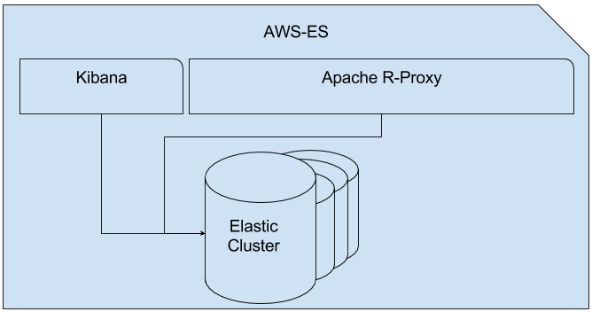

# Elastic Search Cluster

Config guide to explain how configure the ES cluster.
In this guide I will use Docker Compose as orchestator, in order to be able to create and control the whole services. In the next version, I will try to migrate to Docker v1.12 to avoid the use of Docker Compose and use the default Docker core with some scalability utilities.

With this repo, you can configure a Elastic Search cluster with Kibana an Apache as proxy (this is to hide the real ES API to world, and controll the access to the differents EndPoints).

### Overall Architecture



### Install

First of all, you need to install Docker & Docker Compose (I suppose you know how :)
Now, once you have it, you can set up all the environment. 

```sh
$ docker-compose up -d
```
Once you do this, you will have the images and the containers created. All this images are in the same default network, but to control this better, I create an internal network called *es-network*.
As you can see, Docker has created 6 differents containers:
	
  - es-master
  - es-node_1
  - es-node_2
  - es-node_3
  - apache-proxy
  - kibana


The first **es-master** container is the ElasticSearch master of the cluster. This is the node responsible for the whole control of the cluster, and where the other nodes will be connected to. (The one which receive requests to store/update/retrieve data)

The containers with names like **es-node_*** are the nodes of the ElasticSearch cluster. This nodes are the ones which will store and manage data inside the cluster.

Another container, **apache-proxy**, is the reverse proxy related to control the access and redirect the requests to the ElasticSearch end-points. This container mapping the internal port ```5000``` to ```17560```, in order to hide a bit more the API. Besides that, the configuration of the proxy uses a client certificate which is required to sign the origin of the requests. So, only if you have the server certificate to sign the request you will be able to make requests to this API. To sum up, the ``AWS API Gateway`` is the only one who can make requests to this proxy because is the owner of the server certificate.

The last container, **kibana**, as you can imagine, is the app through you can access to Kibana. This container maps the internal port ``5601`` to ``17561``, so if you want to view the Kibana, you should make a request to the server name at this port. 

```
TIPS:

  - The only two ports that should be opened are 17560 and 17561. One for the Proxy and the other for Kibana.
  - The configuration for the Apache and Kibana includes a SSL/TLS set up, so all the request should be made through HTTPS protocol.
  - Once the whole system has been set up, you can check if it's working making a request to Kibana. Another way is through the AWS API Gateway. 

```

With this configuration (inside the ```docker-compose.yml```) the cluster is a bit small and fix. If you want to create more nodes to spread the data, you can copy&paste one of the nodes and change the name. Once you re-deploy it with Docker, it will automatically connect to the master and added to the cluster.

###Troubles
The Apache R-Proxy is responsible to hide the ES API to the real world, so only the signed requests are allowed. In order to protect this a bit more, we add an ```AWS API Gateway```. This API is responsible to authorize, or not, the clients which calls the ES API. This expose a __fake__ API which only redirect the requests to the Proxy if the tokens, and signature, provided in HTTP Headers are corrects. In other case an HTTP error should be thrown.
Today (01/02/2017), there are only two Secrets and Access Keys that provides access to the API. So, if you need a new one you should ask @owust.

To configure this API Gateway you need to create some end-points which maps to the internals ES, this is manual and must be done through AWS Console (UI). To login into this UI you need the POPmessage credentials. Once you have it, and are inside the service, you can add some new methods/resources or change the permissions on each method. When this is done, you need to deploy the API in a stage. Today (04/07/2017) the main stage to deploy the API is ```ES-PROD``` and all authentication methods must be active (IAM Role & API Key)